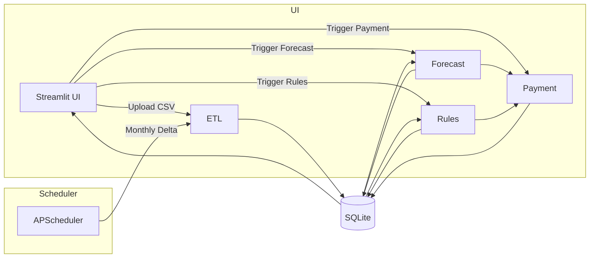

# Architecture for streamlit-cashflow-forecast

Detailed high-level design for the project.

## 1. Overall Project Structure

```text
streamlit-cashflow-forecast/
├── .github/
│   └── workflows/
│       └── ci.yml
├── Dockerfile
├── docker-compose.yml
├── pyproject.toml
├── README.md
├── docs/
│   └── architecture.md
├── src/
│   ├── db/
│   │   ├── models.py
│   │   └── session.py
│   ├── etl/
│   │   └── etl.py
│   ├── scheduler/
│   │   └── scheduler.py
│   ├── forecast/
│   │   └── forecast.py
│   ├── rules/
│   │   └── rules.py
│   ├── payment/
│   │   └── payment.py
│   └── ui/
│       └── app.py
└── tests/
    ├── db/
    ├── etl/
    ├── forecast/
    ├── rules/
    └── payment/
```

## 2. Folder & File Responsibilities

**.github/workflows/ci.yml**  
Automate lint (black, flake8), type checks (mypy), unit tests (pytest).

**Dockerfile & docker-compose.yml**  
Containerize Streamlit app and scheduler; mount SQLite volume.

**pyproject.toml**  
Define Python 3.11 and dependencies.

**docs/**  
Documentation, including architecture design (this file).

**src/db/models.py**  
SQLAlchemy ORM definitions: suppliers, creditors, rule_changes, forecasts, payment_plans.

**src/db/session.py**  
Create SQLite engine and session factory.

**src/etl/etl.py**  
CSV ingestion and transformation (pandas) → database (full & incremental).

**src/scheduler/scheduler.py**  
APScheduler setup for monthly delta ETL job.

**src/forecast/forecast.py**  
Prophet model training & forecasting; persist to forecasts table.

**src/rules/rules.py**  
Natural-language rule engine to evaluate and tag data.

**src/payment/payment.py**  
Compute payment plans based on forecasts and rules.

**src/ui/app.py**  
Streamlit web UI: upload data, run ETL, forecast, rules, payments, and visualize results.

**tests/**  
Unit tests organized by module.

## 3. Technology Stack & Dependencies

- Python 3.11  
- pandas, SQLAlchemy, sqlite3 (builtin), APScheduler, prophet, rule-engine or spaCy, Streamlit  
- Dev: pytest, flake8, black, mypy  
- Docker, docker-compose  
- CI/CD: GitHub Actions  

## 4. Data Flow & Component Interactions



**Flows:**  
- Upload CSV → ETL → DB  
- DB → Forecast & Rules → DB  
- Forecast & Rules → Payment → DB  
- UI reads from DB and renders tables/charts  
- Scheduler triggers ETL on schedule  

## 5. Deployment Approach

- **Streamlit Community Cloud:** One-click deploy from GitHub.  
- **Local / Dev:** docker-compose to run app and scheduler with SQLite volume.  
- **CI/CD:** GitHub Actions on push → lint, test, build.